Getting started: NEMoE
================
Xiangnan Xu

# Introduction

Nutrition-Enterotype Mixture of Expert Model(NEMoE) is an R package that
facilitates discover latent classes shaped by nutrition intake that
makes relationship between gut microbiome and health outcome different.

The methods use a regularized mixture of experts model framework
identify such latent classes and using EM algorithm to fitting the
parameters in the model.

In this vignette, we go through a 16S microbiome data of Parkinson’s
disease to identify the latent classes shaped by nutrition intake and
finding the microbiome signatures for each latent class.

``` r
library(ggplot2)
library(NEMoE)
library(phyloseq)
```

# Gut microbiome and Parkinson’s disease

The `PD` dataset contain data from a gut microbiome-Parkinson’s disease
study, the nutrition intake of each individual is also provided from
food frequency questionnaire. We provide two type of the
data(i.e. phyloseq object and a list) to construct input of NEMoE.

In this example, we will use NEMoE to identify two latent class of
different nutrition pattern with altered microbiome-PD relationships and
identify the related nutrition features for the latent class and
microbiome signatures for each latent class.

``` r
data("PD")
```

## Build the `NEMoE` object from list

First we build the `NEMoE` object, the input data to build `NEMoE` have
three part: microbiome data, nutrition data and health outcome. The
nutrition data can be either matrix or dataframe which each row is a
sample and each column is a nutrient. The microbiome data can be either
a list of table that contain several microbiome matrix where each row is
a sample and each column is a taxa (at the level) or a `phyloseq`. The
response is a vector of different health state.

In the following example, we build `NEMoE` object from list of
microbiome data.

``` r
Microbiome = PD$data_list$Microbiome
Nutrition = PD$data_list$Nutrition
Response = PD$data_list$Response
```

NEMoE object can also incorporate the parameters used in the fitting,
including `K`,`lambda1`, `lambda2`, `alpha1`, `alpha2` and `cvParams`.

``` r
NEMoE = NEMoE_buildFromList(Microbiome, Nutrition, Response, K = 2, 
                            lambda1 = c(0.005, 0.014, 0.016, 0.023, 0.025),
                            lambda2 = 0.02, alpha1 = 0.5, alpha2 = 0.5)
```

### Fit the `NEMoE` object

Now using the `fitNEMoE` function, we can fit `NEMoE` object with the
specified parameters in the `NEMoE` object.

``` r
NEMoE = fitNEMoE(NEMoE)
#> Fitting NEMoE.... 
#> it: 0, PLL0:-501.619
#> it: 1, PLL:-500.746
#> it: 2, PLL:-499.965
#> it: 3, PLL:-499.247
#> it: 4, PLL:-498.522
#> it: 5, PLL:-497.749
#> it: 6, PLL:-496.892
#> it: 7, PLL:-495.909
#> it: 8, PLL:-494.746
#> it: 9, PLL:-493.337
#> it: 10, PLL:-491.622
#> it: 11, PLL:-489.529
#> it: 12, PLL:-487.006
#> it: 13, PLL:-484.229
#> it: 14, PLL:-481.513
#> it: 15, PLL:-479.01
#> it: 16, PLL:-476.819
#> it: 17, PLL:-475.002
#> it: 18, PLL:-473.644
#> it: 19, PLL:-472.703
#> it: 20, PLL:-472.1
#> it: 21, PLL:-471.708
#> it: 22, PLL:-471.444
#> it: 23, PLL:-471.266
#> it: 24, PLL:-471.143
#> it: 25, PLL:-471.058
#> it: 26, PLL:-471.001
#> it: 27, PLL:-470.963
#> it: 28, PLL:-470.935
#> it: 29, PLL:-470.914
#> it: 30, PLL:-470.897
#> it: 31, PLL:-470.883
#> it: 32, PLL:-470.871
#> it: 33, PLL:-470.86
#> it: 34, PLL:-470.851
#> it: 35, PLL:-470.842
#> it: 36, PLL:-470.833
#> it: 37, PLL:-470.824
#> it: 38, PLL:-470.814
#> it: 39, PLL:-470.803
#> it: 40, PLL:-470.789
#> it: 41, PLL:-470.771
#> it: 42, PLL:-470.75
#> it: 43, PLL:-470.73
#> it: 44, PLL:-470.71
#> it: 45, PLL:-470.692
#> it: 46, PLL:-470.674
#> it: 47, PLL:-470.656
#> it: 48, PLL:-470.638
#> it: 49, PLL:-470.621
#> it: 50, PLL:-470.603
#> it: 51, PLL:-470.585
#> it: 52, PLL:-470.569
#> it: 53, PLL:-470.555
#> it: 54, PLL:-470.542
#> it: 55, PLL:-470.53
#> it: 56, PLL:-470.52
#> it: 57, PLL:-470.511
#> it: 58, PLL:-470.5
#> it: 59, PLL:-470.492
#> it: 60, PLL:-470.481
#> it: 61, PLL:-470.471
#> it: 62, PLL:-470.47
#> it: 63, PLL:-470.47
#> it: 64, PLL:-470.47
#> it: 65, PLL:-470.47
#> it: 66, PLL:-470.469
#> it: 67, PLL:-470.469
#> it: 68, PLL:-470.469
```

The fitted log-likelihood can be get from `getLL` function.

``` r
getLL(NEMoE)
#>            LL_obs   PLL_obs LL_complete PLL_complete
#> Phylum  -90.29506 -117.7473   -147.2789    -174.7311
#> Order   -84.96665 -116.4175   -139.6226    -171.0734
#> Family  -82.71688 -115.5229   -139.3969    -172.2029
#> Genus   -78.65367 -113.8171   -144.3031    -179.4665
#> ASV     -64.79430 -109.3006   -133.2118    -177.7181
#> All    -401.42655 -470.4693   -703.8133    -772.8560
```

The corresponding coefficients in gating function, i.e. the effect size
of each nutrition variables of their contribution to the different
latent class can be obtained from `getCoef` function.

``` r
coef.Gating <- getCoef(NEMoE)$coef.gating
```

These coefficients of gating network can be plotted by `plotGating`
function.

``` r
p_list <- plotGating(NEMoE)
```

``` r
print(p_list[[1]])
```

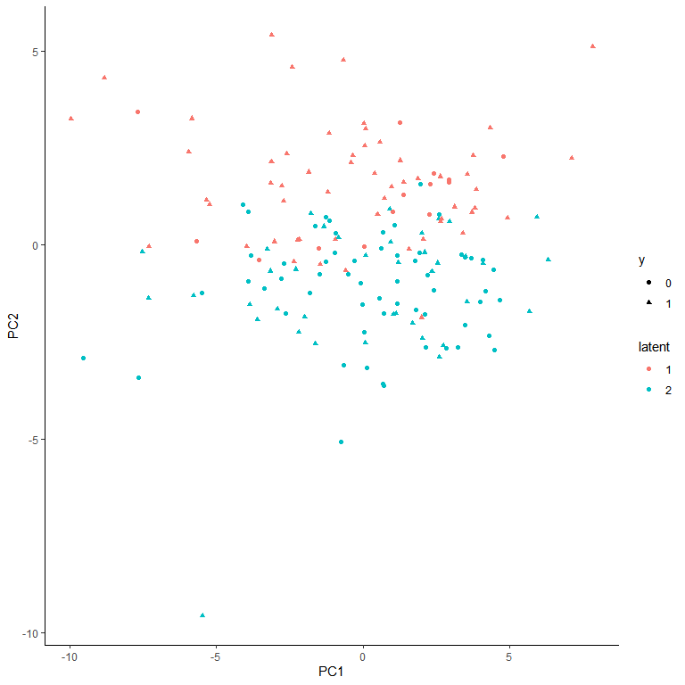<!-- -->

``` r
print(p_list[[2]])
```

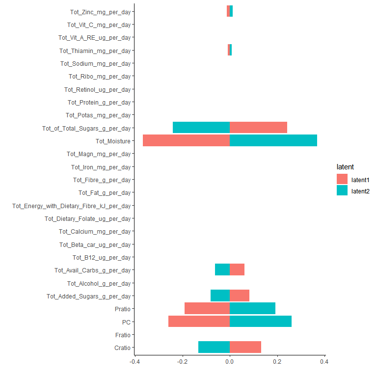<!-- -->

The corresponding coefficients in experts network, i.e. the effect size
of each microbiome features of their contribution to health outcome (PD
state here) in different latent class can be obtained from `getCoef`
function.

``` r
coef.Experts <- getCoef(NEMoE)$coef.experts
```

These coefficients of experts network can be plotted by `plotGating`
function.

``` r
p_list <- plotExperts(NEMoE)
```

``` r
print(p_list[[1]] + ggtitle("Coefficients of Phylum level") + theme(axis.text.x = element_text(angle = 45))) 
```

<!-- -->

``` r
print(p_list[[2]] + ggtitle("Coefficients of Order level") + theme(axis.text.x = element_text(angle = 45))) 
```

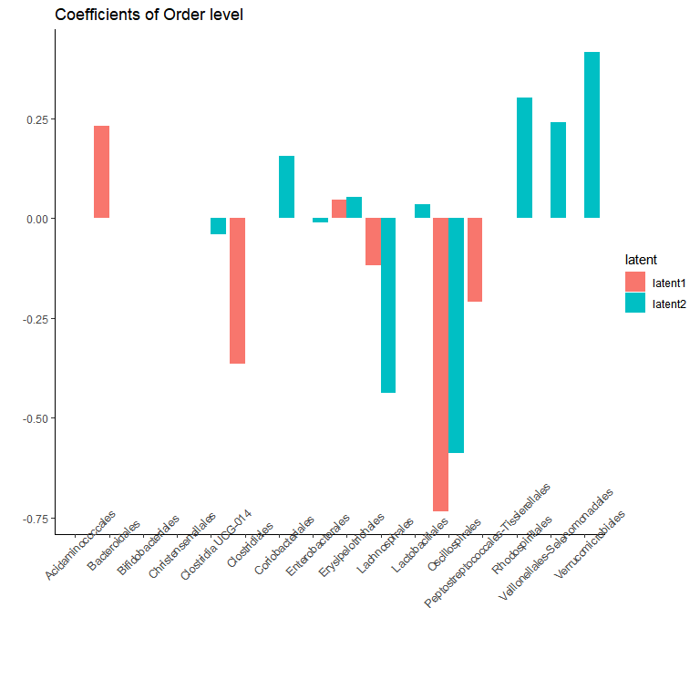<!-- -->

``` r
print(p_list[[3]] + ggtitle("Coefficients of Family level") + theme(axis.text.x = element_text(angle = 45))) 
```

<!-- -->

``` r
print(p_list[[4]] + ggtitle("Coefficients of Genus level") + theme(axis.text.x = element_text(angle = 45, size = 5))) 
```

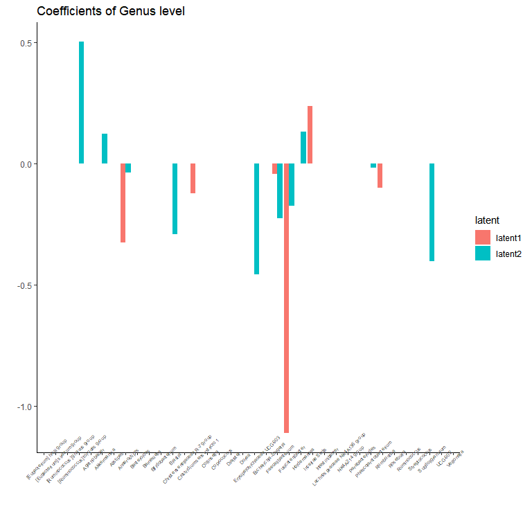<!-- -->

``` r
print(p_list[[5]] + ggtitle("Coefficients of ASV level") + theme(axis.text.x = element_blank())) 
```

<!-- -->

### Single level `NEMoE`

`NEMoE` can also built based on single level data, we illustrated it
using `Genus` level of the Microbiome-PD dataset.

``` r
Microbiome_gen <- Microbiome$Genus
```

``` r
NEMoE_gen = NEMoE_buildFromList(Microbiome_gen, Nutrition, Response, K = 2, 
                            lambda1 = 0.028, lambda2 = 0.02,
                            alpha1 = 0.5, alpha2 = 0.5)
```

``` r
NEMoE_gen <- fitNEMoE(NEMoE_gen, restart_it = 20)
#> Fitting NEMoE.... 
#> it: 0, PLL0:-95.7996
#> it: 1, PLL:-95.5171
#> it: 2, PLL:-95.3391
#> it: 3, PLL:-95.2305
#> it: 4, PLL:-95.1652
#> it: 5, PLL:-95.1261
#> it: 6, PLL:-95.1022
#> it: 7, PLL:-95.0873
#> it: 8, PLL:-95.0779
#> it: 9, PLL:-95.0717
#> it: 10, PLL:-95.0676
#> it: 11, PLL:-95.0648
#> it: 12, PLL:-95.063
#> it: 13, PLL:-95.0617
#> it: 14, PLL:-95.0607
#> it: 15, PLL:-95.0601
#> it: 16, PLL:-95.0596
#> it: 17, PLL:-95.0593
#> it: 18, PLL:-95.0591
#> it: 19, PLL:-95.0589
#> it: 20, PLL:-95.0588
#> it: 21, PLL:-95.0587
#> it: 22, PLL:-95.0587
#> it: 23, PLL:-95.0587
#> it: 24, PLL:-95.0587
#> it: 25, PLL:-95.0587
```

``` r
p_list <- plotGating(NEMoE_gen)
```

``` r
print(p_list[[1]])
```

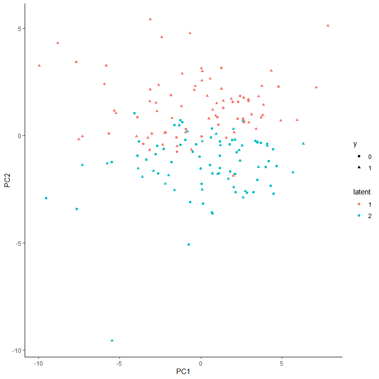<!-- -->

``` r
print(p_list[[2]])
```

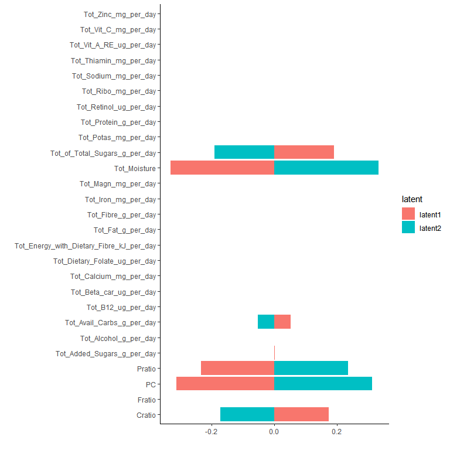<!-- -->

``` r
p <- plotExperts(NEMoE_gen)[[1]]
p + theme(axis.text.x = element_text(angle = 45, size = 5))
```

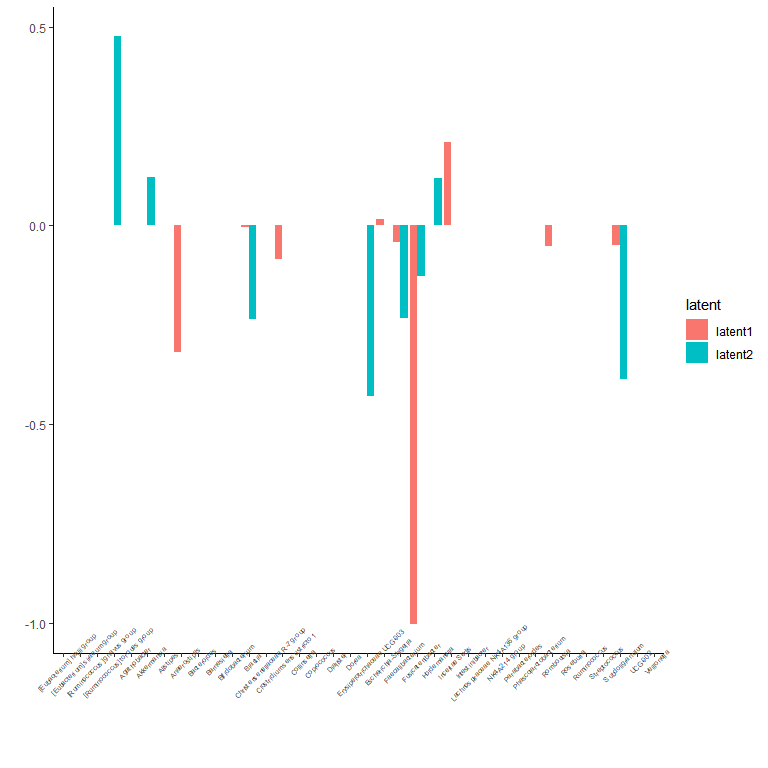<!-- -->

## Build the `NEMoE` object from phyloseq

In parallel, `NEMoE` object can be built from `phyloseq` object from the
microbiome counts data. `NEMoE` wrapper functions for TSS normalization
and transformations of the counts data. Also which levels of the data
incorporated in the data can be determined by user.

``` r
sample_PD <- sample_data(PD$ps)
Response <- sample_PD$PD
Nutrition <- sample_PD[,-ncol(sample_PD)]
```

In the following example, we first TSS normalized data, then filter the
taxa with prevalance larger than 0.7 (i.e. the taxa non-zero in more
than 70% of the sample) and variance larger than 5e-5. Then the data are
further tranformed using arcsin transformation and zscored. The
resulting Microbiome data is to used built `NEMoE` object.

``` r
NEMoE_ps <- NEMoE_buildFromPhyloseq(ps = PD$ps, Nutrition = scale(Nutrition),
                                 Response = Response,  K = 2, 
                                 lambda1 = c(0.005, 0.014, 0.016, 0.023, 0.025),
                                 lambda2 = 0.02, alpha1 = 0.5, alpha2 = 0.5,
                                 filtParam = list(prev = 0.7, var = 1e-5),
                                 transParam = list(method = "asin", scale = T),
                                 taxLevel = c("Phylum","Order","Family",
                                              "Genus","ASV"))
```

The `NEMoE` object can also be fitted and visualized as it is in the
previous section.

``` r
NEMoE_ps <- fitNEMoE(NEMoE_ps)
#> Fitting NEMoE.... 
#> it: 0, PLL0:-494.62
#> it: 1, PLL:-493.94
#> it: 2, PLL:-493.284
#> it: 3, PLL:-492.686
#> it: 4, PLL:-492.094
#> it: 5, PLL:-491.481
#> it: 6, PLL:-490.83
#> it: 7, PLL:-490.129
#> it: 8, PLL:-489.357
#> it: 9, PLL:-488.485
#> it: 10, PLL:-487.511
#> it: 11, PLL:-486.401
#> it: 12, PLL:-485.14
#> it: 13, PLL:-483.711
#> it: 14, PLL:-482.088
#> it: 15, PLL:-480.307
#> it: 16, PLL:-478.45
#> it: 17, PLL:-476.66
#> it: 18, PLL:-475.071
#> it: 19, PLL:-473.713
#> it: 20, PLL:-472.585
#> it: 21, PLL:-471.669
#> it: 22, PLL:-470.943
#> it: 23, PLL:-470.389
#> it: 24, PLL:-469.979
#> it: 25, PLL:-469.67
#> it: 26, PLL:-469.436
#> it: 27, PLL:-469.256
#> it: 28, PLL:-469.116
#> it: 29, PLL:-469.004
#> it: 30, PLL:-468.932
#> it: 31, PLL:-468.885
#> it: 32, PLL:-468.852
#> it: 33, PLL:-468.827
#> it: 34, PLL:-468.81
#> it: 35, PLL:-468.797
#> it: 36, PLL:-468.789
#> it: 37, PLL:-468.782
#> it: 38, PLL:-468.777
#> it: 39, PLL:-468.773
#> it: 40, PLL:-468.77
#> it: 41, PLL:-468.767
#> it: 42, PLL:-468.766
#> it: 43, PLL:-468.764
#> it: 44, PLL:-468.763
#> it: 45, PLL:-468.762
#> it: 46, PLL:-468.761
#> it: 47, PLL:-468.761
#> it: 48, PLL:-468.761
#> it: 49, PLL:-468.76
#> it: 50, PLL:-468.76
#> it: 51, PLL:-468.76
#> it: 52, PLL:-468.76
```

``` r
p_list <- plotGating(NEMoE_ps)
```

``` r
print(p_list[[1]])
```

<!-- -->

``` r
print(p_list[[2]])
```

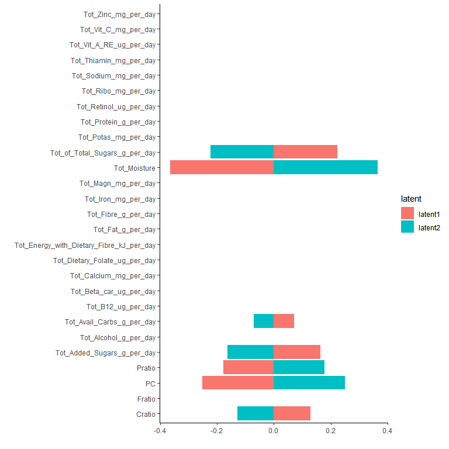<!-- -->

``` r
p_list <- plotExperts(NEMoE)
```

``` r
print(p_list[[1]] + ggtitle("Coefficients of Phylum level") + theme(axis.text.x = element_text(angle = 45))) 
```

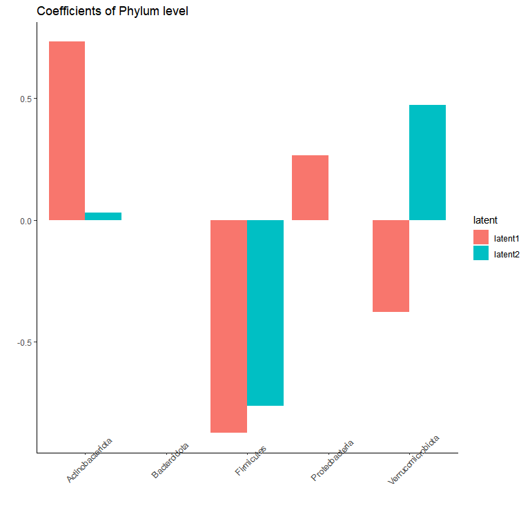<!-- -->

``` r
print(p_list[[2]] + ggtitle("Coefficients of Order level") + theme(axis.text.x = element_text(angle = 45))) 
```

<!-- -->

``` r
print(p_list[[3]] + ggtitle("Coefficients of Family level") + theme(axis.text.x = element_text(angle = 45))) 
```

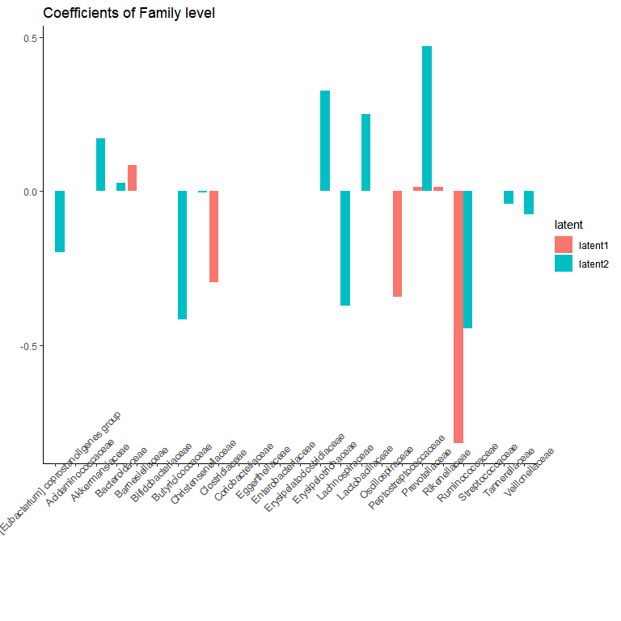<!-- -->

``` r
print(p_list[[4]] + ggtitle("Coefficients of Genus level") + theme(axis.text.x = element_text(angle = 45, size = 5))) 
```

<!-- -->

``` r
print(p_list[[5]] + ggtitle("Coefficients of ASV level") + theme(axis.text.x = element_blank())) 
```

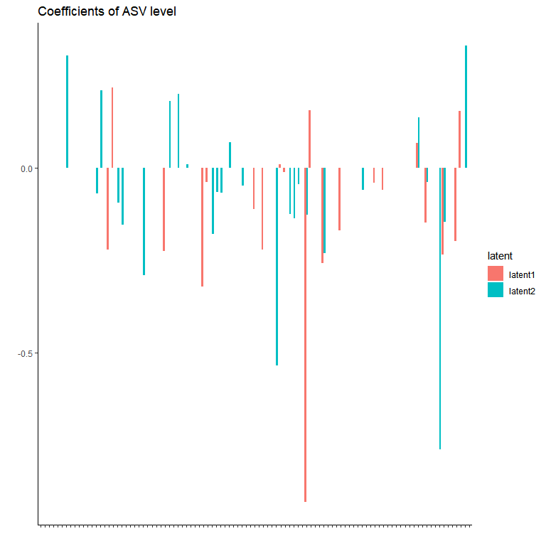<!-- -->

## Evaluation and cross validation of NEMoE

We provide many metric including statistics such as `AIC`, `BIC` and
`ICL` and cross validation metric such as cross validation accuracy and
AUC.

``` r
calcCriterion(NEMoE, "all")
#>            AIC       BIC      ICL1      ICL2     eBIC      mAIC      mBIC
#> [1,] -996.8531 -1299.878 -1601.627 -1904.651 -1662.26 -1028.853 -1311.193
#>          mICL1     mICL2  accuracy  D.square       TPR      TNR        F1
#> [1,] -1633.627 -1915.966 0.6904412 0.1508229 0.7907833 0.561678 0.7411134
#>            auc
#> [1,] 0.7766071
```

Also the one can use this procedure to select parameters.

``` r
NEMoE <- cvNEMoE(NEMoE)
```

The selected parameters obtained from the cross validation result can be
used to fitting the model.

``` r
lambda1_choose <- NEMoE@cvResult$lambda1_choose
lambda2_choose <- NEMoE@cvResult$lambda2_choose
```

``` r
NEMoE <- setParam(NEMoE, lambda1 = lambda1_choose, lambda2 = lambda2_choose)
```

``` r
NEMoE <- fitNEMoE(NEMoE)
#> Fitting NEMoE.... 
#> it: 0, PLL0:-512.127
#> it: 1, PLL:-510.904
#> it: 2, PLL:-509.676
#> it: 3, PLL:-508.346
#> it: 4, PLL:-506.931
#> it: 5, PLL:-505.254
#> it: 6, PLL:-503.251
#> it: 7, PLL:-501.001
#> it: 8, PLL:-498.556
#> it: 9, PLL:-496.056
#> it: 10, PLL:-493.692
#> it: 11, PLL:-491.587
#> it: 12, PLL:-489.846
#> it: 13, PLL:-488.528
#> it: 14, PLL:-487.592
#> it: 15, PLL:-486.952
#> it: 16, PLL:-486.523
#> it: 17, PLL:-486.231
#> it: 18, PLL:-486.025
#> it: 19, PLL:-485.875
#> it: 20, PLL:-485.763
#> it: 21, PLL:-485.671
#> it: 22, PLL:-485.588
#> it: 23, PLL:-485.506
#> it: 24, PLL:-485.429
#> it: 25, PLL:-485.354
#> it: 26, PLL:-485.279
#> it: 27, PLL:-485.215
#> it: 28, PLL:-485.158
#> it: 29, PLL:-485.107
#> it: 30, PLL:-485.059
#> it: 31, PLL:-485.013
#> it: 32, PLL:-484.971
#> it: 33, PLL:-484.931
#> it: 34, PLL:-484.89
#> it: 35, PLL:-484.848
#> it: 36, PLL:-484.805
#> it: 37, PLL:-484.757
#> it: 38, PLL:-484.713
#> it: 39, PLL:-484.667
#> it: 40, PLL:-484.616
#> it: 41, PLL:-484.566
#> it: 42, PLL:-484.513
#> it: 43, PLL:-484.454
#> it: 44, PLL:-484.384
#> it: 45, PLL:-484.299
#> it: 46, PLL:-484.192
#> it: 47, PLL:-484.058
#> it: 48, PLL:-483.92
#> it: 49, PLL:-483.832
#> it: 50, PLL:-483.772
#> it: 51, PLL:-483.73
#> it: 52, PLL:-483.701
#> it: 53, PLL:-483.683
#> it: 54, PLL:-483.671
#> it: 55, PLL:-483.664
#> it: 56, PLL:-483.661
#> it: 57, PLL:-483.66
#> it: 58, PLL:-483.659
#> it: 59, PLL:-483.659
#> it: 60, PLL:-483.656
#> it: 61, PLL:-483.646
#> it: 62, PLL:-483.626
#> it: 63, PLL:-483.625
#> it: 64, PLL:-483.624
#> it: 65, PLL:-483.623
#> it: 66, PLL:-483.622
#> it: 67, PLL:-483.621
#> it: 68, PLL:-483.621
#> it: 69, PLL:-483.615
#> it: 70, PLL:-483.596
#> it: 71, PLL:-483.564
#> it: 72, PLL:-483.529
#> it: 73, PLL:-483.489
#> it: 74, PLL:-483.457
#> it: 75, PLL:-483.445
#> it: 76, PLL:-483.442
#> it: 77, PLL:-483.44
#> it: 78, PLL:-483.44
#> it: 79, PLL:-483.44
#> it: 80, PLL:-483.439
#> it: 81, PLL:-483.438
#> it: 82, PLL:-483.428
#> it: 83, PLL:-483.336
#> it: 84, PLL:-483.105
#> it: 85, PLL:-483.061
#> it: 86, PLL:-483.032
#> it: 87, PLL:-483.014
#> it: 88, PLL:-483.002
#> it: 89, PLL:-482.996
#> it: 90, PLL:-482.992
#> it: 91, PLL:-482.99
#> it: 92, PLL:-482.99
#> it: 93, PLL:-482.99
#> it: 94, PLL:-482.99
#> it: 95, PLL:-482.99
```

``` r
p_list <- plotGating(NEMoE_ps)
```

``` r
print(p_list[[1]])
```

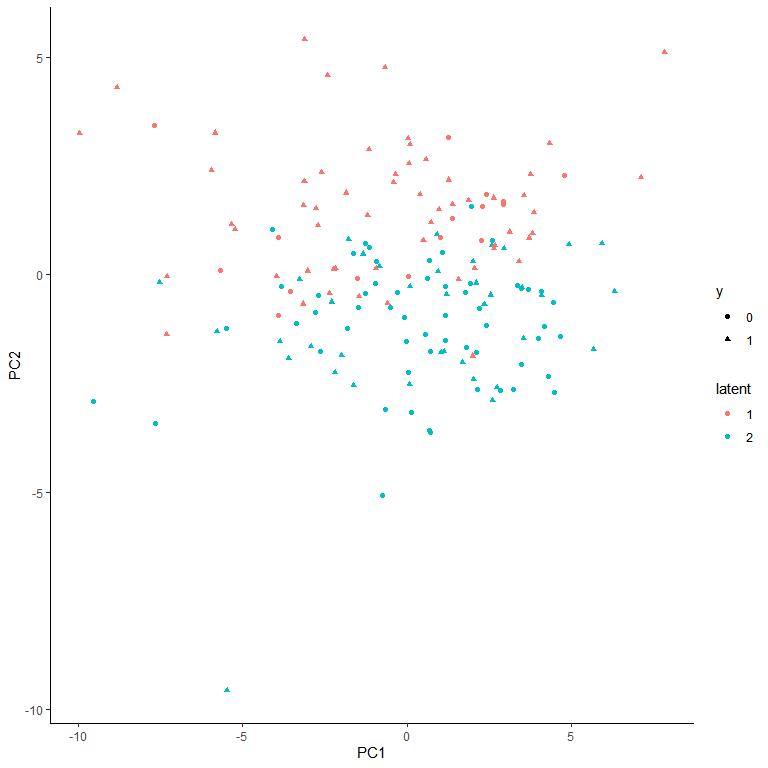<!-- -->

``` r
print(p_list[[2]])
```

<!-- -->

``` r
p_list <- plotExperts(NEMoE)
```

``` r
print(p_list[[1]] + ggtitle("Coefficients of Phylum level") + theme(axis.text.x = element_text(angle = 45))) 
```

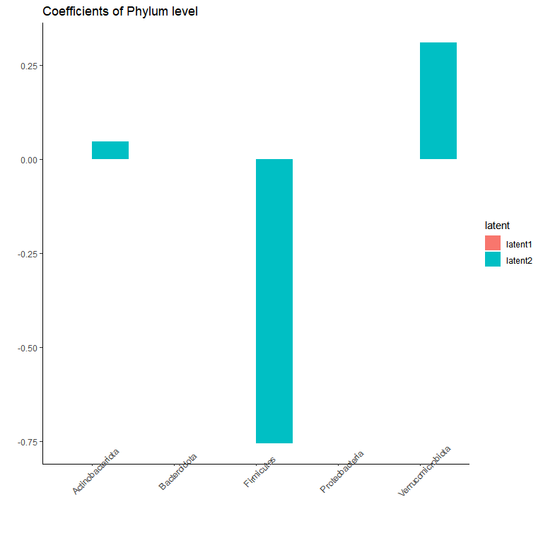<!-- -->

``` r
print(p_list[[2]] + ggtitle("Coefficients of Order level") + theme(axis.text.x = element_text(angle = 45))) 
```

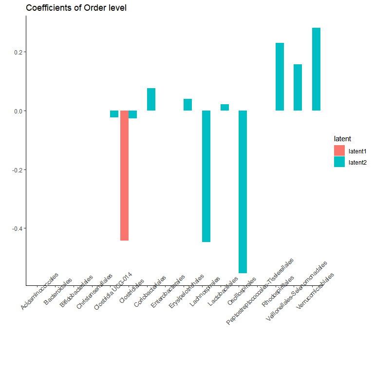<!-- -->

``` r
print(p_list[[3]] + ggtitle("Coefficients of Family level") + theme(axis.text.x = element_text(angle = 45))) 
```

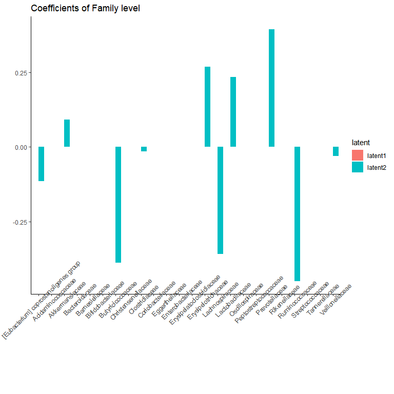<!-- -->

``` r
print(p_list[[4]] + ggtitle("Coefficients of Genus level") + theme(axis.text.x = element_text(angle = 45, size = 5))) 
```

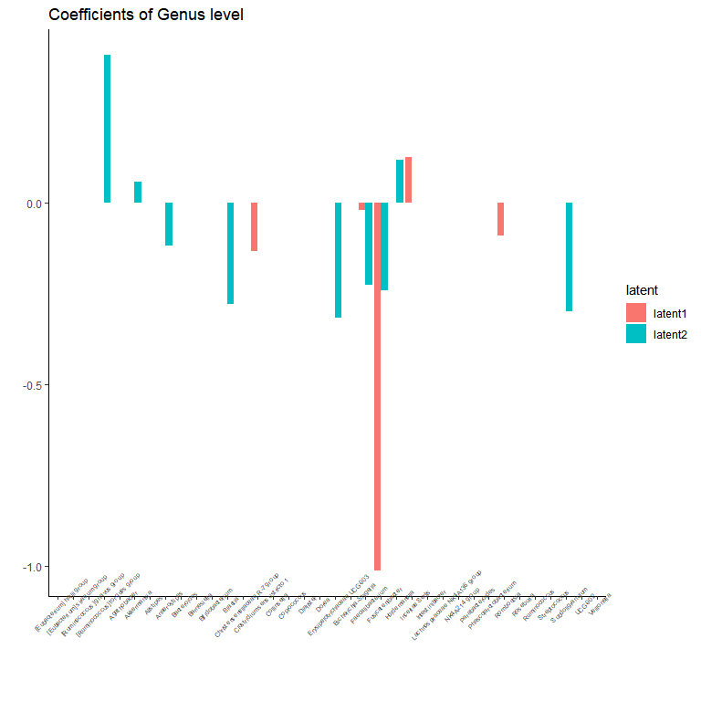<!-- -->

``` r
print(p_list[[5]] + ggtitle("Coefficients of ASV level") + theme(axis.text.x = element_blank())) 
```

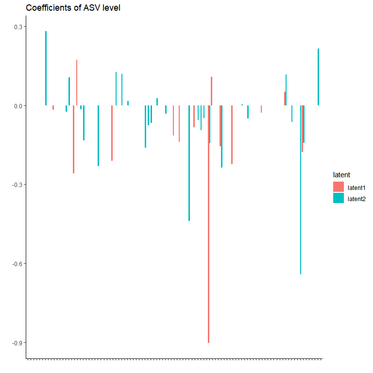<!-- -->

# Misc

``` r
sessionInfo()
#> R version 4.1.0 (2021-05-18)
#> Platform: x86_64-w64-mingw32/x64 (64-bit)
#> Running under: Windows 10 x64 (build 19042)
#> 
#> Matrix products: default
#> 
#> locale:
#> [1] LC_COLLATE=Chinese (Simplified)_China.936 
#> [2] LC_CTYPE=Chinese (Simplified)_China.936   
#> [3] LC_MONETARY=Chinese (Simplified)_China.936
#> [4] LC_NUMERIC=C                              
#> [5] LC_TIME=Chinese (Simplified)_China.936    
#> 
#> attached base packages:
#> [1] stats     graphics  grDevices utils     datasets  methods   base     
#> 
#> other attached packages:
#> [1] phyloseq_1.36.0 NEMoE_1.1.0     ggplot2_3.3.5  
#> 
#> loaded via a namespace (and not attached):
#>  [1] mclust_5.4.7           Rcpp_1.0.7             ape_5.5               
#>  [4] lattice_0.20-44        Biostrings_2.60.2      glmnet_4.1-2          
#>  [7] assertthat_0.2.1       digest_0.6.27          foreach_1.5.1         
#> [10] utf8_1.2.2             R6_2.5.1               GenomeInfoDb_1.28.4   
#> [13] plyr_1.8.6             stats4_4.1.0           evaluate_0.14         
#> [16] highr_0.9              pillar_1.6.2           zlibbioc_1.38.0       
#> [19] rlang_0.4.11           data.table_1.14.0      vegan_2.5-7           
#> [22] S4Vectors_0.30.0       Matrix_1.3-4           rmarkdown_2.10        
#> [25] labeling_0.4.2         splines_4.1.0          BiocParallel_1.26.2   
#> [28] stringr_1.4.0          igraph_1.2.6           RCurl_1.98-1.4        
#> [31] munsell_0.5.0          compiler_4.1.0         xfun_0.25             
#> [34] pkgconfig_2.0.3        BiocGenerics_0.38.0    multtest_2.48.0       
#> [37] shape_1.4.6            mgcv_1.8-36            htmltools_0.5.2       
#> [40] biomformat_1.20.0      tidyselect_1.1.1       tibble_3.1.4          
#> [43] GenomeInfoDbData_1.2.6 IRanges_2.26.0         codetools_0.2-18      
#> [46] permute_0.9-5          fansi_0.5.0            crayon_1.4.1          
#> [49] dplyr_1.0.7            withr_2.4.2            MASS_7.3-54           
#> [52] bitops_1.0-7           rhdf5filters_1.4.0     grid_4.1.0            
#> [55] nlme_3.1-153           jsonlite_1.7.2         gtable_0.3.0          
#> [58] lifecycle_1.0.0        DBI_1.1.1              magrittr_2.0.1        
#> [61] scales_1.1.1           stringi_1.7.4          ROCR_1.0-11           
#> [64] farver_2.1.0           XVector_0.32.0         reshape2_1.4.4        
#> [67] ellipsis_0.3.2         generics_0.1.0         vctrs_0.3.8           
#> [70] Rhdf5lib_1.14.2        iterators_1.0.13       tools_4.1.0           
#> [73] ade4_1.7-17            Biobase_2.52.0         glue_1.4.2            
#> [76] purrr_0.3.4            survival_3.2-13        parallel_4.1.0        
#> [79] fastmap_1.1.0          yaml_2.2.1             colorspace_2.0-2      
#> [82] rhdf5_2.36.0           cluster_2.1.2          knitr_1.34
```
